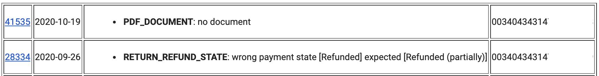

#  Shopware orders scanner

Extensible tool to scan orders in <a href=https://www.shopware.com/en/products/shopware-6/>Shopware 6</a> online shop system. 
It finds orders in inconsistent states and generates a report.

## Motivation

An order in Shopware has multiple attributes which change during the order lifecycle:
- Payment status
- Delivery status
- Order status
- Tracking code
- Documents, i.e. delivery slip
- Custom fields, i.e. external order id, external line item ids, warehouse order id, partial cancellations, returns and refunds

One could think of inter-dependencies between the above mentioned attributes.

- If an order has delivery status: Shipped, then normally it should have a tracking code and might have a delivery slip upload as a document.
- If an order is Cancelled, then it should be refunded. (In the case it has been ever paid by a customer)

## How it works

The tool uses Shopware 6.3 REST-style API to get a list of orders created and/or updated during a specific time interval. By default for the previous day.
 
 
Then it examines an each order by a set of checks. Those orders which fail to pass at least one check are marked as suspicious.
 
 
Later an HTML report for the inconsistent orders is generated. Then it is sent out as an email via <a href=https://sendgrid.com/>Sendgrid</a> API.

Report format could be customized and prettified. 
 
 
In the example above first column represents an order number and has link to this order in Shopware Admin UI. Second column represents order's creation date. Third column indicate all checks which order has failed to pass. Fourth column has a tracking code.

## Running locally

To run this tool locally several environment variables have to be provided in [local.env](local.env) file:
- SHOPWARE_BASE_URL
- SHOPWARE_CLIENT_ID
- SHOPWARE_CLIENT_SECRET

For the latter two it is recommended to create a separate read-only <a href=https://docs.shopware.com/en/shopware-6-en/settings/system/integrationen>Shopware integration</a>.

By default sending of a report as an email is disabled and requires separate configuration.

- setting *SENDGRID_ENABLED* to true
- providing meaningful values for all variables with *SENDGRID* prefix

When not using email reports one can get a list of inconsistent orders from the tool standard log.